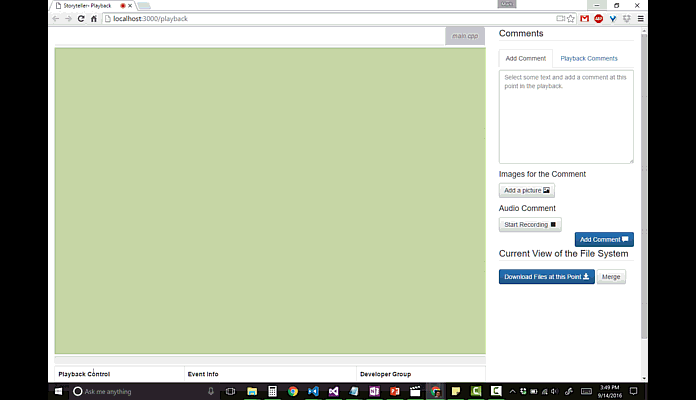
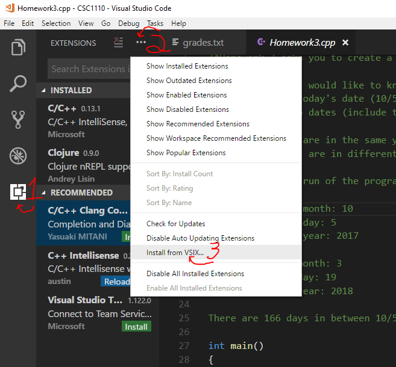
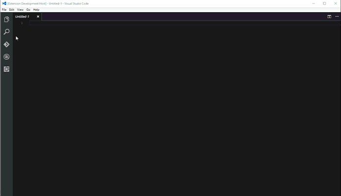
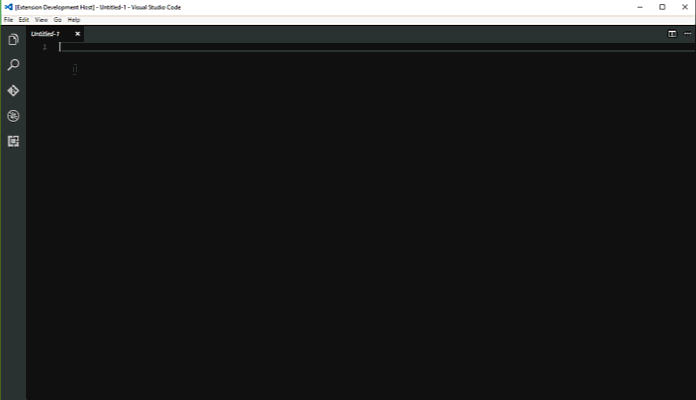
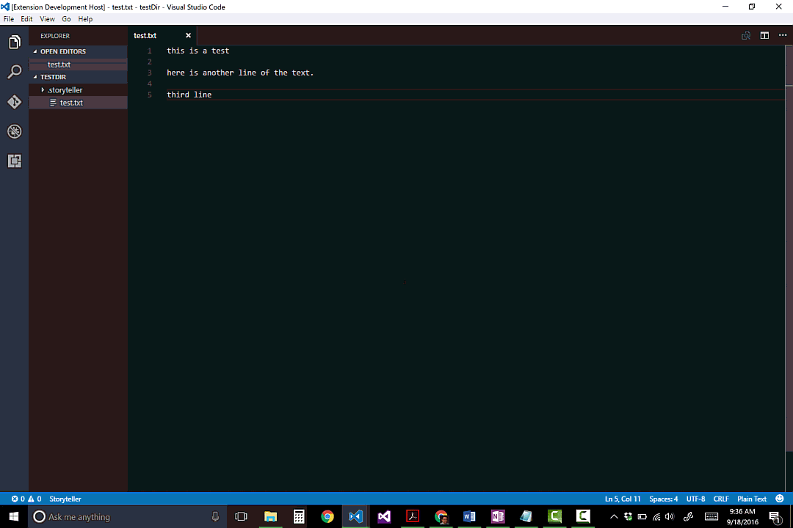
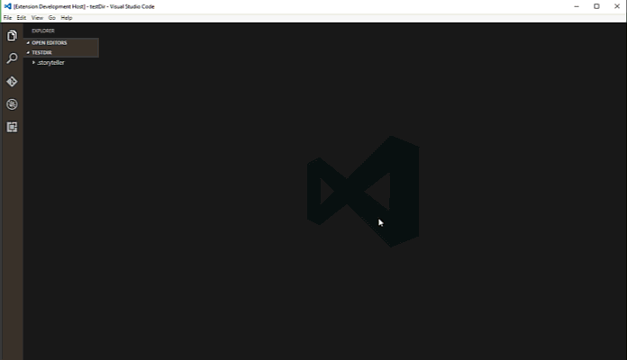
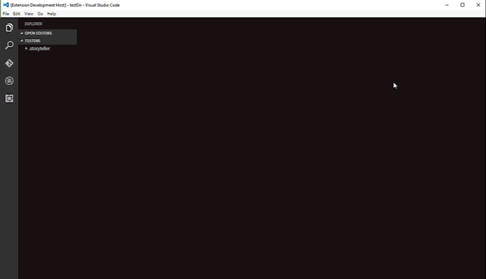
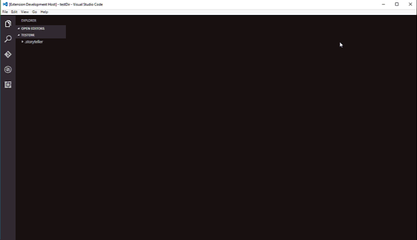
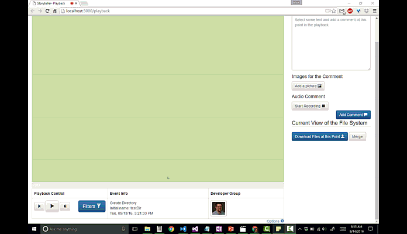
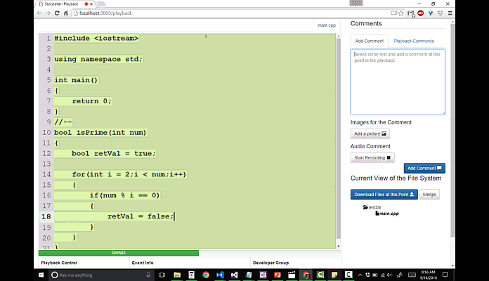

# Storyteller
While writing code we generate many creative ideas. We visualize our systems from different perspectives and weigh different options. Eventually, we make decisions about how our systems will evolve. Sometimes we make mistakes or learn more about what we are building and have to go back and revise our code.

Often, there is not a good place to write down our thoughts and ideas about the development process. It can be difficult to learn from experienced developers because we don't get to see them make their decisions or hear the reasons why they made them. A less experienced developer can learn a great deal from a more experienced one if they can get inside the head of the more experienced developer and be walked through the 'why'.

Storyteller records all of the changes made during programming sessions and allows them to be played back and annotated. This allows developers to reflect on what they have done, write down their thoughts, and draw pictures to tell the story of how their code has evolved.

## Playback
### Code Comments
Code comments are not always the best place to describe one's thoughts and ideas. After all, it doesn't make a lot of sense to have a code comment describing why one changed the name of a variable from `weight` to `volumeOfPackage` if `weight` is no longer present in the code after the change. The same can be said of an algorithm that gets refactored to improve performance or a serious bug that was fixed.

_**These are evolutionary decisions that, if documented, can provide valuable learning experiences for others.**_

Some experts find code comments to be too verbose and annoying. Some newcomers complain that the lack of any meaningful comments is frustrating. The fact that there are many different audiences for code comments is hard to deal with in simple text files.

Storyteller allows code comments that are evolutionary in nature to be moved out of the code and stored separately from it. The extracted code comments are still directly linked to the code, however. Doing this allows there to be multiple sets of independent comments reaching different audiences.

These comments coexist together without interfering with each other. It will be up to the reader to decide which, if any comments, to display with the code.

In addition to moving the code comments out of the code, Storyteller was designed to allow two major differences between traditional code comments:

- It is possible to link a set of comments to time and location rather than just the location in code. This allows people to more easily understand how the code has evolved over time. A developer can create a narrative about how and why her code evolved the way it did that is linked to how the code actually did evolve.

- It is possible to create comments using a richer media than plain text so that developers can better describe their ideas and thought processes. Storyteller allows you to draw pictures in your comments, store screenshots that can be marked up, and record audio.

### Examples
Here are some examples in C++ and Clojure:
* [An Animated Introduction to Programming in C++](https://personal.carthage.edu/mmahoney/cppbook/)
* [An Animated Introduction to Clojure](https://personal.carthage.edu/mmahoney/cljbook/)

(this tool is not solely for educational purposes- it is for anyone who wants to show others how they thought about a problem while coding it).

Some notes about playback. You can use the pause/play button (`space bar`) to stop/restart a playback. To speed things up use `shift-up arrow` (`shift-down arrow` slows things down too). You can skip the animation of code altogether and just focus on the code and comments by selecting the forward button `>>` (`shift-right arrow` will accomplish this as well). 

## Install
Currently there is a [Visual Studio Code](https://code.visualstudio.com/) Storyteller editor plugin (this is not the full MS Visual Studio IDE- it is a newer, lightweight editor similar to notepad++, sublime, and atom).

To install the plugin first make sure you have [VS Code](https://code.visualstudio.com/Download) installed and get familiar with it.

Next, download the Storyteller plugin file, [storyteller-0.0.1.vsix](storyteller-0.0.1.vsix). To install the plugin, 
1. go to the 'Extensions' tab. 
2. select the '...' at the top
3. choose 'install from VSIX'
4. restart VS Code

To completely remove the extension, delete the storyteller extension folder located here:

- Windows: `%USERPROFILE%\.vscode\extensions`
- Mac: `~/.vscode/extensions`
- Linux: `~/.vscode/extensions`

This is still a work in progress. Do not throw out your existing tools and use this for your mission critical code yet. It will get more stable over time. Having said that I am interested hearing about any bugs that are found or feature requests.

## Quick Start
### VS Code Plugin
#### Starting a brand new project
Create a new directory on the filesystem. Start Visual Studio code. Open the directory (`File -> Open Folder...`) on your file system to start tracking.

Storyteller will prompt for the name and email of the developer to be the author of the code. Enter in a first name, last name, and email address (the email address will be used to retrieve a [gravatar](https://en.gravatar.com/) during playback). If you would like to remain anonymous just hit the escape key in the prompt.

#### Opening an existing project
Start visual studio code. Open a directory (`File -> Open Folder...`). Select a folder on your file system. If Storyteller has tracked this directory in the past there will be a hidden directory (named .storyteller/) that holds the project's historical data. Storyteller will continue to track changes in this directory. There is no need to log in again. On subsequent startups VS Code opens the last used folder by default.

#### Starting a playback from the editor
In the editor, when you are ready to view a playback bring up VS Code's command palette (`Ctrl-Shift P`) and select `Storyteller: Start Playback`. This will open a browser window with playback controls to view it.

#### Managing active developers
Storyteller records the developer or groups of developers who are responsible for new code. The developer groups' information is displayed during playback.

To create a new developer use the command palette and choose `Storyteller: Create a New Developer`

To add an existing developer to the current developer group use the command palette and choose `Storyteller: Make Developers Active`

To remove an existing developer from the current developer group use the command palette and choose `Storyteller: Make Developers Inactive`

#### Viewing a playback
A playback recreates one or more programming sessions. There are controls to play/pause (space bar shortcut), step one change at a time (left/right arrow shortcut), and jump to a point in the playback with a slider control.

The playback shows the timestamp of when the latest change took place, the state of the file system at every point, the developer(s) who made the change, and which file and location in the file where the change takes place.

There are filters available to limit what gets played back. The filters include time filters, developer filters, file filters, and selected text filters.

#### Making a comment
While viewing a playback a comment can be added by pausing the playback and adding text, an image, or an audio recording. The comment will be stored at the pause point. In future playbacks the playback will pause and the comment will be displayed.

## Features
### Recording
- Storyteller works with editors and IDEs to record keystrokes and file operations in the order that they happened.

  - The system records 'programming events' like text inserts, text deletes, and file operations (create/delete/rename/move). For each event, the system records the location in the file system that the event affects, the developer or developers who is responsible for it, and the timestamp when the event occurred.

  Storyteller uses this data to create animated playbacks of programming sessions. These playbacks visualize how the code was originally written and provides a mechanism to hold comments (or stories) that a developer wishes to add to their code. The developer can guide the viewer with a narrative explaining how the code was built.

- Recording only happens in a user specified directory. All changes outside of this directory are ignored by the Storyteller.
- Storyteller data is stored in a hidden folder in the directory being tracked and can span multiple programming sessions. The data can be deleted at anytime. If there is a programming session you are not particularly proud of it is easy delete your Storyteller history without losing any of the actual code.
- The user can start with an existing set of code not previously created while using Storyteller. All existing code will be added to the Storyteller database in one big block. A developer can then add to the code from that import point and see the history from then on.
- If some files or directories get deleted from the file system when Storyteller is not active, the code can be recreated and added back to the file system. The user has the option of adding the files back to the file system or leaving them deleted.
- If some code gets changed by another editor or tool when Storyteller is not active, the differences are added to the Stroyteller database using a diff tool and will be played back as if they happened while Storyteller was active.

### Playback
- A playback replays the coding events in a browser in the order that they happened. The information displayed about each event includes the type of event, the timestamp when the event happened, the developer(s) who created the event, and the place in the file and file system where the event happened.
- When creating a playback a user can choose how much of a programming session to replay.

  There are filters to limit what gets played back. Most filters can be combined with each other.

  - One can choose to filter by time. There is a filter to see what happened in the last 3 hours, last week, from January to February, or any other time frame. Only the changes that happened in that time frame are animated.
  - One can choose to filter by developer. There is a filter to only see the changes made by one or more developers. For example, one can choose to see only the changes made by Bob and Alice.
  - One can choose to filter by files. There is a filter to only see the changes that happened in one or more files. For example, one can choose to see only the changes made to main.js and styles.css.
  - One can choose to filter by selected text. There is a filter that will replay the changes in a user selected portion of code. The playback will go back in time and show only the selected code and any code that at one time touched it.
  
  Every playback animates and highlights the code that satisfies the filters. Code that does not meet the filter requirements is added to the playback view but is not animated. In other words, if one filters to see the code written in the last hour, all of the code previous to that time frame will be displayed as a starting point but only the latest code will be dynamically added into it.

- The viewer can jump to any point in the playback with a slider control.

- The viewer can control how fast or slow the system animates the code.

  The system can be configured to automatically pause playbacks at comment points. If the user chooses the fastest option there will be no animation of code at all but playback will pause on comments. This is useful if the viewer would just like to see the code and comments at comment points.

- Blocks of code that have been pasted in the editor in blocks can either be animated fully one character at a time or shown as a single insert event.

- The user can pause any playback and download the state of the files at that point. A zip file is created with the same file structure as the code in the playback. This is useful if a viewer would like to run code from any state in a playback.

### Commenting
- During a playback a user can pause and add a comment that describes the code in its current state. This comment will be shown on future playbacks at the same point.
  - The user can add text to describe what is happening in the code.

  - The user can select code that goes along with the comment and it will be highlighted when the comment is displayed.
  
  - The user can draw a picture that goes along with the comment. They can also choose to use an existing drawing as a starting point for a new drawing.

  - The user can upload an image (and then draw on it) that goes along with the comment. This is useful for capturing screenshots.

  - The user can add an audio comment to capture a conversation between team members or to tell a longer story that might take too long to type.

- The user can save the data in a playback to a file and use it to view a playback over and over again. These files can be posted on websites or added as attachments to emails. Developers will write code, create playbacks, reflect on their work, guide the viewer with a meaningful narrative, and then share them with others. _**This promotes teaching and learning on a team.**_

  A developer might make a playback with comments:

  - At the end of each day to reflect on what they have accomplished. Good software developers reflect on their work. Storyteller promotes identifying good decisions to be repeated and bad decisions to be avoided in the future. The insight gained from this reflection might be valuable at a standup meeting and can be shared with others who are interested in seeing the changes.

  - Before each version control commit. Most version control commit messages do not tell a complete story. A lot of changes in a lot of different places can happen even in a few hours of writing code. Replaying the changes reminds the developer exactly what they have done since the last commit. A developer can add a link to a playback for anyone interested in the complete story of the commit.

  - After each new feature is implemented, bug fixed, refactoring session, etc.
  
  - Before a code review to give the reviewers some insight into the developers thought processes.

- The user can add comments to a playback from the editor. A new playback will be created that is at the exact same point as the editor and the user can add a comment.

- The viewer can choose to skip the animation of the code and only show the state of the code and the comments at comment points.

### Version control
Storyteller supports basic version control functionality. One can create a new branch of development and merge another branch into an existing one. To create a branch the user chooses the option to 'Download the files at this point'. A zip file with the state of the files and its history will be saved to your machine. Open it up with Storyteller to make changes from that point.

To merge in the changes from another branch the user chooses the 'Merge' option. If there are conflicts on the same line the both sets of changes will be added to the code. The changes are added to the in-memory version of the code. Simply download the files again and the merged code will be in the new repository. 

### Sharing
- There are three ways to share playbacks with others.
  - Download and save the web page that is displaying the playback using the browser (`ctrl-s` in most browsers). The page is self contained and can be viewed offline, sent in an email, or added to a web server.
  - Download the state of the code at any point in the playback. This will cause a zip to be downloaded that will include the state of the file system at the pause point. One can use this to view a playback. It can also be used to branch from any point in the playback so others can build from your code. In order to perform this download click on "Download Files at this Point" in the web page and choose one of the history options. 
  - Download the playback data only. A JSON file containing all of the data needed to animate a playback will be downloaded to your file system. That JSON file can be read in from a playback web page to load it. To download and read in existing JSON files choose the "Options" pop-up and select "Save this Playback" to download and "Upload a Playback" to read and existing JSON file.  

### Developers
- One or more people can be identified as the developer(s) creating new code. This is good for recording code written in pair programming scenarios.
- The active developers can be displayed, developers can be added and removed from the active group. New developers can be added to the system with just a name and email.

## Contact
I am looking for people to contribute. Reach out to me if you are interested in helping build Storyteller!

I welcome any comments, suggestions, or questions. I am looking forward to having discussions about the ideas that this tool addresses.

Mark Mahoney [mmahoney@carthage.edu](mailto:mmahoney@carthage.edu)

